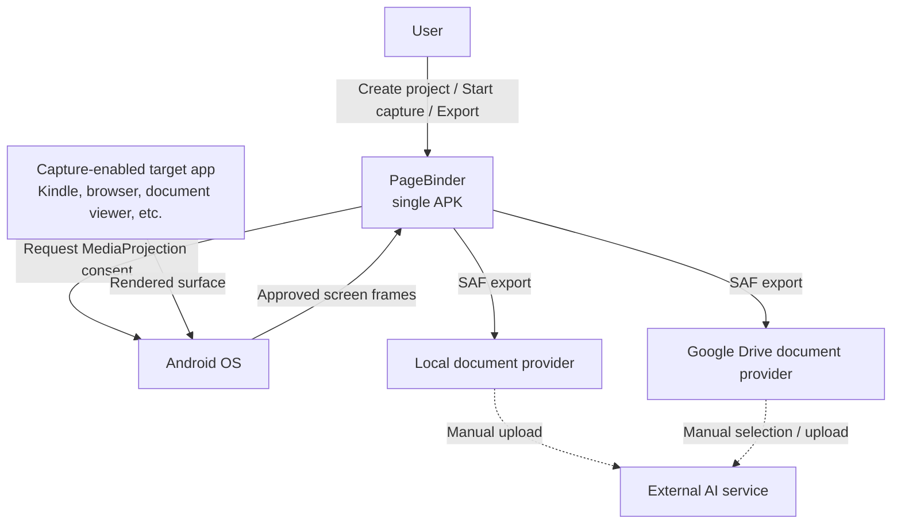
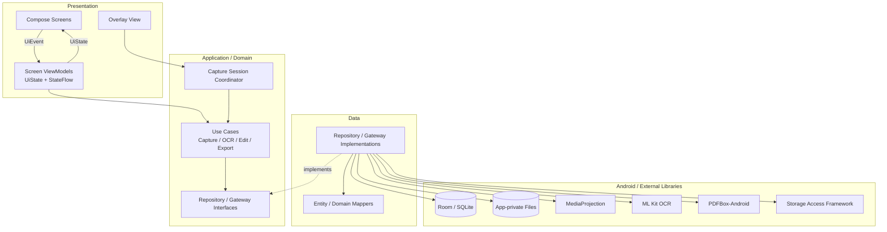
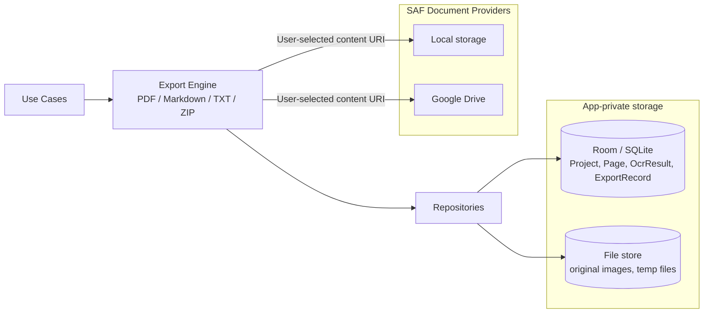
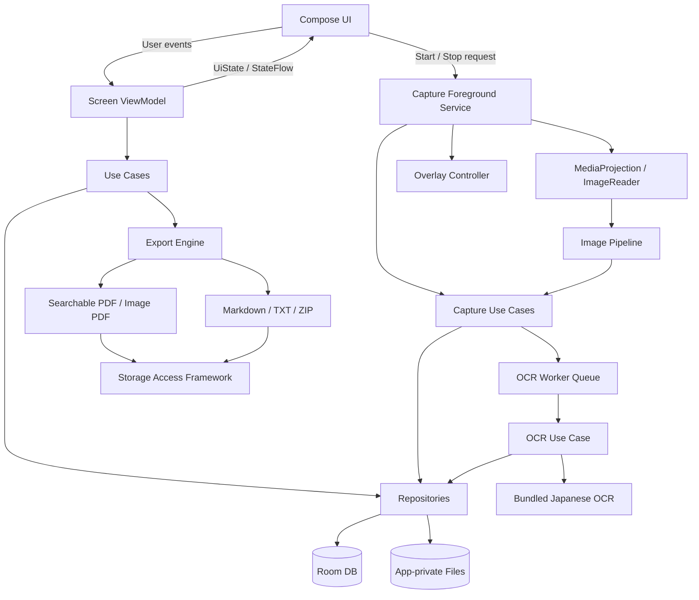

# PageBinder

画面キャプチャ・OCR・PDF化 Androidアプリ

## 要件定義兼基本仕様書 v0.1

| 項目 | 内容 |
|---|---|
| プロダクト名 | PageBinder |
| 文書状態 | 初版・実装前レビュー用 |
| 作成日 | 2026-08-25 |
| 対象 | 個人利用向けAndroid APK |
| 対応OS | Android 10（API 29）以降 |
| 主用途 | 利用者が閲覧中の画面を整理して保存し、端末内OCRを行い、検索可能PDF・Markdown等へ書き出す |

> 本文書は製品・技術仕様を定めるものであり、個別の利用行為が適法であることを保証する法律意見ではない。

---

## 1. 目的

利用者が正当に閲覧できるコンテンツについて、必要な画面を手動または補助的な連続撮影で保存し、書籍・資料単位で整理する。保存画像から日本語OCRを端末内で実行し、次の成果物を生成する。

- 文字を選択・検索できるOCR付きPDF
- 画像のみのPDF（フォールバック）
- ページ単位のOCRテキスト
- 全ページを統合したMarkdown
- 元画像一式のZIP
- ページとOCR結果を対応付けるメタデータ

アプリ自身は外部AIと通信しない。利用者が書き出した成果物を、必要に応じて別のAIサービスへ手動で渡す。

## 2. 設計原則

1. **完全オフライン**：アプリに `INTERNET` 権限を付与しない。
2. **利用者主導**：撮影開始、画面共有、保存、書き出しは利用者の明示操作で行う。
3. **保護機構を回避しない**：撮影禁止・保護画面を取得する回避処理を実装しない。
4. **最小権限**：アクセシビリティ権限、連絡先、位置情報等を要求しない。
5. **ローカルファースト**：作業データはアプリ専用領域に保存し、完成物だけ利用者指定先へ書き出す。
6. **復元可能性**：誤削除を防ぎ、編集中のページ操作は取り消せるようにする。
7. **検証可能性**：画像、OCRテキスト、PDF上のテキストをページ番号で追跡できるようにする。

## 3. 確定事項

| 項目 | 決定 |
|---|---|
| 配布 | 個人利用APKの直接インストール。Google Play公開は将来検討 |
| 対応端末 | Android 10以降のスマートフォン・タブレット |
| 画面方向 | 縦・横の両方 |
| 撮影対象 | OSが撮影を許可する全アプリ |
| 基本操作 | フローティングボタンによる手動撮影 |
| 連続撮影 | 画面変化を検出して新しい画面だけ保存する補助モードを提供 |
| 自動ページ送り | MVPでは非採用。理由は「8.4 自動ページ送り」を参照 |
| OCR | ML Kit Text Recognition v2 日本語モデルをAPKへ同梱 |
| 通信 | `INTERNET` 権限なし。外部AI連携なし |
| 保存 | 作業中はアプリ専用領域。書き出しはStorage Access Framework（SAF） |
| Google Drive | SAFの保存先として選択可能。Drive専用APIは使用しない |
| PDF | OCR付き検索可能PDFを正式要件とし、画像PDFも生成可能にする |
| 書籍情報 | タイトル、著者、メモ、作成日時、更新日時 |

## 4. 対象範囲

### 4.1 MVPに含める

- 書籍プロジェクトの作成・編集・削除
- 画面キャプチャの許可取得と撮影セッション管理
- 他アプリ上に表示する撮影ボタン
- 手動撮影
- 画面変化検出型の連続撮影
- ページ画像の連番保存
- サムネイル一覧
- ページの削除、並べ替え、回転、切り取り
- 重複ページ警告
- 黒画面・撮影失敗の検出
- 日本語OCR
- OCR結果の手動修正
- OCR付き検索可能PDF
- 画像PDF、Markdown、TXT一式、元画像ZIP、メタデータの出力
- 端末内またはGoogle Drive等への書き出し

### 4.2 MVPに含めない

- 外部AIへのアップロード
- クラウドOCR
- クラウド同期・自動バックアップ
- DRM、`FLAG_SECURE`、保護サーフェス等の回避
- 他アプリのログイン情報・UI階層の取得
- Kindle等の特定アプリ専用連携
- アクセシビリティサービスを使った自動ページ送り
- Play Store公開対応
- iOS版

## 5. 想定利用者と利用条件

### 5.1 想定利用者

- 自身が正当に閲覧できる資料を個人用に整理したい利用者
- OCR結果を検索、要約、調査等の入力資料として使いたい利用者

### 5.2 利用上の前提

- 利用者は対象コンテンツを閲覧する正当な権限を持つ。
- 利用者は複製、書き出し、外部サービスへの入力可否を自身で確認する。
- アプリは撮影禁止画面を回避しない。
- 成果物の共有・配布機能は設けず、書き出し先は利用者が明示的に選択する。

## 6. 主要ユースケース

### UC-01 新しい書籍を作成する

1. 利用者がホーム画面で「新しい書籍」を選ぶ。
2. タイトルを必須入力する。
3. 著者とメモを任意入力する。
4. アプリが書籍プロジェクトと保存領域を作成する。
5. 書籍詳細画面へ遷移する。

### UC-02 手動でページを撮影する

1. 書籍詳細画面で「撮影開始」を選ぶ。
2. 必要な場合、他アプリ上への表示権限を案内する。
3. OSの画面共有許可ダイアログを表示する。
4. 利用者が共有対象を選択し、許可する。
5. アプリがフォアグラウンド撮影サービスと撮影ボタンを開始する。
6. 利用者が対象アプリへ移動する。
7. 利用者が撮影ボタンを押す。
8. アプリが撮影ボタンを一時的に非表示にし、安定したフレームを保存する。
9. 保存成功を振動・視覚表示で通知する。
10. OCR処理をバックグラウンドキューへ登録する。

### UC-03 連続撮影する

1. 利用者が撮影開始時に「連続撮影」を選ぶ。
2. 最短待機時間を設定する（初期値2秒、設定範囲1～30秒）。
3. 利用者が手動でページをめくる。
4. アプリが画面差分を監視する。
5. 画面が安定し、前回保存画像との差が閾値を超えた場合のみ保存する。
6. 同一・近似画面は保存せず、必要に応じて状態表示する。
7. 利用者がフローティング停止ボタンまたは通知から終了する。

### UC-04 ページを編集する

1. 利用者がサムネイル一覧を開く。
2. ページを選択する。
3. 削除、並べ替え、回転、切り取り、OCR修正のいずれかを行う。
4. 画像変更時はOCRを再実行する。
5. 変更履歴を1操作以上保持し、直前操作を取り消せるようにする。

### UC-05 成果物を書き出す

1. 利用者が書籍詳細画面で「書き出し」を選ぶ。
2. 出力形式を選択する。
3. 未処理または失敗したOCRページがあれば警告する。
4. 書き出し前の利用上の注意を表示する。
5. SAFの保存画面を開く。
6. 利用者が端末内、Google Drive等の保存先を選択する。
7. アプリが出力し、成功・失敗を表示する。

## 7. 機能要件

### 7.1 書籍プロジェクト管理

| ID | 要件 | 優先度 |
|---|---|---|
| FR-PRJ-001 | タイトルを必須として書籍を作成できる | Must |
| FR-PRJ-002 | 著者、メモを任意で登録・編集できる | Must |
| FR-PRJ-003 | 作成日時、更新日時、ページ数を自動管理する | Must |
| FR-PRJ-004 | 書籍を更新日時順に一覧表示する | Must |
| FR-PRJ-005 | 書籍削除前に対象・ページ数・容量を表示して確認する | Must |
| FR-PRJ-006 | 削除はアプリ内ごみ箱を経由し、一定期間は復元可能にする | Should |

### 7.2 権限と撮影セッション

| ID | 要件 | 優先度 |
|---|---|---|
| FR-SES-001 | 画面共有の許可は撮影セッションごとにOS標準画面で取得する | Must |
| FR-SES-002 | 撮影中は常時通知を表示する | Must |
| FR-SES-003 | 通知から撮影停止できる | Must |
| FR-SES-004 | 画面ロック、OSによる停止、別投影開始を検知して安全に終了する | Must |
| FR-SES-005 | 端末回転・共有領域のサイズ変更に追従する | Must |
| FR-SES-006 | オーバーレイ権限がない場合、設定画面へ案内する | Must |
| FR-SES-007 | オーバーレイ権限を拒否した場合、アプリ画面内撮影以外は開始しない | Must |

### 7.3 手動撮影

| ID | 要件 | 優先度 |
|---|---|---|
| FR-CAP-001 | フローティングボタンを1回押すと1ページ保存する | Must |
| FR-CAP-002 | 撮影直前にボタンを隠し、ボタンが写り込まないようにする | Must |
| FR-CAP-003 | 二重タップ・連打による重複保存を抑止する | Must |
| FR-CAP-004 | 保存成功時に短い振動とページ番号を表示する | Must |
| FR-CAP-005 | 保存失敗時に理由と再試行手段を表示する | Must |
| FR-CAP-006 | 撮影ボタンの位置を移動し、画面端へ吸着できる | Should |
| FR-CAP-007 | 撮影音は初期状態で無効とし、任意で有効化できる | Could |

### 7.4 連続撮影

| ID | 要件 | 優先度 |
|---|---|---|
| FR-AUTO-001 | 利用者の開始操作後、画面差分を監視できる | Must |
| FR-AUTO-002 | ページ変更後、画面が一定時間安定したときだけ保存する | Must |
| FR-AUTO-003 | 前回ページとの近似重複を判定し、同じページを保存しない | Must |
| FR-AUTO-004 | 最短保存間隔を1～30秒で設定できる | Should |
| FR-AUTO-005 | 連続撮影中であることをオーバーレイと通知に明示する | Must |
| FR-AUTO-006 | 最大ページ数または最大時間を設定し、自動停止できる | Should |
| FR-AUTO-007 | 画面変化の検出感度を3段階で設定できる | Could |

### 7.5 画像処理・品質判定

| ID | 要件 | 優先度 |
|---|---|---|
| FR-IMG-001 | 画像を可逆または視認劣化のない形式で保存する | Must |
| FR-IMG-002 | 画像の向き、寸法、撮影日時を保存する | Must |
| FR-IMG-003 | 平均輝度と画素分散から黒画面・単色画面を検出する | Must |
| FR-IMG-004 | perceptual hashにより近似重複を検出する | Must |
| FR-IMG-005 | 利用者が切り取り範囲をページごとに変更できる | Must |
| FR-IMG-006 | 同一書籍に共通の切り取り設定を一括適用できる | Should |
| FR-IMG-007 | 元画像を保持し、編集は非破壊で行う | Must |

### 7.6 OCR

| ID | 要件 | 優先度 |
|---|---|---|
| FR-OCR-001 | 日本語・英数字を端末内で認識する | Must |
| FR-OCR-002 | OCRモデルをAPKに同梱し、実行時ダウンロードを不要にする | Must |
| FR-OCR-003 | ページ単位でOCR状態を管理する | Must |
| FR-OCR-004 | テキスト、行・ブロック順、座標を保存する | Must |
| FR-OCR-005 | OCR失敗ページを再実行できる | Must |
| FR-OCR-006 | OCRテキストを利用者が修正できる | Must |
| FR-OCR-007 | 画像編集後はOCR結果を古い状態として扱い、再実行を促す | Must |
| FR-OCR-008 | 縦書き、ルビ、段組みの認識品質を個別に検証する | Must |
| FR-OCR-009 | OCR処理中も撮影操作を妨げない | Must |

### 7.7 ページ編集

| ID | 要件 | 優先度 |
|---|---|---|
| FR-EDT-001 | サムネイルをページ順に表示する | Must |
| FR-EDT-002 | ドラッグ操作で並べ替えできる | Must |
| FR-EDT-003 | 単一・複数ページを削除できる | Must |
| FR-EDT-004 | 90度単位で回転できる | Must |
| FR-EDT-005 | 切り取り範囲を編集できる | Must |
| FR-EDT-006 | 重複候補を比較して残すページを選べる | Must |
| FR-EDT-007 | 黒画面候補をまとめて確認できる | Should |

### 7.8 書き出し

| ID | 要件 | 優先度 |
|---|---|---|
| FR-EXP-001 | 画像PDFを生成できる | Must |
| FR-EXP-002 | OCRテキスト層付きの検索可能PDFを生成できる | Must |
| FR-EXP-003 | ページ単位TXTと統合Markdownを生成できる | Must |
| FR-EXP-004 | 元画像とメタデータをZIP出力できる | Must |
| FR-EXP-005 | SAFを使って利用者が保存先を選べる | Must |
| FR-EXP-006 | Google DriveがSAFプロバイダとして存在する場合、保存先に選べる | Must |
| FR-EXP-007 | 書き出し途中の失敗を検知し、不完全ファイルを成功扱いしない | Must |
| FR-EXP-008 | 同名ファイルがある場合はOS標準の確認に従う | Must |
| FR-EXP-009 | OCR未完了ページを含む場合、続行または中止を選べる | Must |

## 8. 自動化に関する仕様判断

### 8.1 手動撮影

正式機能とする。利用者が保存対象を明示的に選び、誤取得を抑えられる。

### 8.2 連続自動撮影

正式機能とする。ただし、単純な一定間隔保存ではなく、次の状態機械で制御する。

```text
待機 → 画面変化を検出 → 安定待ち → 重複判定 → 保存 → 待機
                           └ 重複なら保存せず待機
```

このモードでもページ送りは利用者が行う。

### 8.3 画面変化判定

- 低解像度グレースケール画像を生成する。
- 前回保存ページとのdHashまたはpHash距離を計算する。
- 連続する複数フレームの差が閾値以下になったら「安定」と判定する。
- 時計、バッテリー表示、アニメーション等の小領域は判定対象から除外できるようにする。

### 8.4 自動ページ送り

MVPでは採用しない。

技術的にはアクセシビリティサービスの `dispatchGesture()` でスワイプを生成できるが、Android公式はアクセシビリティサービスを障害のある利用者の支援用途として位置付けている。また、権限が強く、誤操作、対象アプリの利用条件、将来の配布審査への影響が大きい。

次の代替を採用する。

- 利用者が手動でページをめくる。
- アプリは画面変化と安定を検知して自動保存する。
- Bluetoothリモコン等によるページ送りは対象アプリ側の標準入力として扱い、本アプリは入力を生成しない。

将来再検討する場合も、アクセシビリティサービスの目的外利用は採用せず、OSまたは対象アプリが正式提供するAPI・入力方式に限定する。

## 9. 画面仕様

### 9.1 ホーム画面

- 書籍一覧
- タイトル、著者、ページ数、更新日時、表紙代替サムネイル
- 新しい書籍ボタン
- 並べ替え：更新日時、作成日時、タイトル
- 書籍検索

### 9.2 書籍作成・編集画面

- タイトル（必須、1～200文字）
- 著者（任意、0～200文字）
- メモ（任意、0～2,000文字）
- 保存、キャンセル

### 9.3 書籍詳細画面

- 書籍情報
- ページ数、OCR完了数、エラー数、使用容量
- 手動撮影開始
- 連続撮影開始
- ページ一覧
- OCR一括実行
- 書き出し
- 書籍設定

### 9.4 撮影準備画面

- 保存先書籍名
- 撮影方式
- 連続撮影時の最短間隔、最大ページ数、最大時間
- オーバーレイ権限状態
- 画面共有許可の説明
- 撮影開始

### 9.5 フローティングUI

- 手動時：撮影、停止
- 連続時：状態表示、一時停止、停止、保存枚数
- ドラッグ移動可能
- 画面端へ吸着
- 撮影直前から保存完了まで一時非表示

### 9.6 ページ一覧・編集画面

- グリッド／リスト切替
- 複数選択
- 削除、回転、切り取り、並べ替え
- OCR状態アイコン
- 重複・黒画面警告

### 9.7 OCR編集画面

- 画像とテキストの上下または左右分割表示
- ページ内検索
- OCR再実行
- 手動修正
- 元のOCR結果へ戻す

### 9.8 書き出し画面

- 出力形式選択
- ファイル名
- ページ範囲
- PDF画質
- OCR未完了警告
- 利用上の注意
- 保存先選択

## 10. 技術アーキテクチャ

### 10.1 採用技術

| 分類 | 採用 |
|---|---|
| 言語 | Kotlin |
| UI | Jetpack Compose + Material 3 |
| 配布単位 | 単一APK |
| Gradle構成 | 初版は単一アプリモジュール（`:app`） |
| アーキテクチャ | レイヤード構成、単方向データフロー（UDF）、画面単位ViewModel |
| 非同期処理 | Kotlin Coroutines / Flow |
| DB | Room |
| 設定 | DataStore |
| 長時間処理 | Foreground Service、WorkManager |
| 画面取得 | MediaProjection + VirtualDisplay + ImageReader |
| オーバーレイ | WindowManager `TYPE_APPLICATION_OVERLAY` |
| OCR | ML Kit Text Recognition v2 Japanese（bundled） |
| PDF | PDFBox-Androidを第一候補とする |
| 外部保存 | Storage Access Framework |
| 画像 | WebP Losslessを基本、互換用PNG出力も可能 |
| DI | Hilt |
| ビルド | Gradle Kotlin DSL + Version Catalog |

SDKは `minSdk 29`、`targetSdk` と `compileSdk` は実装時点の最新安定版とする。

UI層とデータ層を必須とし、撮影、OCR、画像処理、書き出しの複雑な処理はDomain層のUse Caseとして分離する。UIはデータソースへ直接アクセスしない。

画面単位のViewModelは、不変の `UiState` を `StateFlow` としてUIへ公開する。UIからViewModelへイベントを送り、状態はViewModelからUIへ一方向に流す。再利用可能な小さなUI部品にはViewModelを持たせず、通常のState Holderまたは引数で状態を渡す。

### 10.2 システムコンテキスト

アプリとAndroid OS、撮影対象アプリ、外部保存先の境界を示す。点線はアプリ外で利用者が明示的に行う操作であり、本アプリの自動連携ではない。



- 画像取得とOCRは端末内で完結する。
- Google DriveとはDrive APIで直接通信せず、SAFのDocument Providerを利用する。
- 外部AIサービスは本アプリのシステム境界外とする。

### 10.3 論理レイヤーと依存方向

Presentation、Application/Domain、Data、Frameworkの4層に分ける。ソースコード上の依存は原則として上位層から抽象へ向け、Framework固有実装はRepositoryまたはGatewayインターフェースの実装として閉じ込める。



Compose UIは `UiEvent` を画面単位ViewModelへ送る。ViewModelはUse Caseを実行し、不変の `UiState` を `StateFlow` で公開する。Room、ML Kit、PDFBox等の型をPresentation/Application層へ漏らさない。

### 10.4 永続化・書き出し境界

構造化データ、バイナリ、生成成果物は保存責務を分離する。



- Roomはメタデータ、順序、編集状態、OCR構造を保持する。
- 画像と一時ファイルはアプリ専用File Storeに保持し、Roomには相対パスとハッシュを保存する。
- 成果物はSAFから取得した `content://` URIへストリーム出力する。
- アンインストール時にApp-private storageは削除される。SAFで書き出した成果物は対象外である。

### 10.5 技術コンポーネント構成（開発者向け）



### 10.6 モジュール境界

初版は単一APK・単一Gradleアプリモジュール（`:app`）とする。過度なマルチモジュール化を避けながら、次のパッケージ境界で責務を分離する。

```text
app/
  ui/
  domain/
  data/
  capture/
  image/
  ocr/
  export/
  storage/
  legal/
```

PDF生成とOCRはインターフェース越しに利用し、ライブラリ差し替えを可能にする。

コード量、ビルド時間、複数人開発、再利用要件のいずれかが増大した時点で、`capture`、`ocr`、`export` 等を独立したGradleライブラリモジュールへ分割する。初版では将来の分割を妨げない依存方向を維持するが、先行してモジュールを増やさない。

## 11. 撮影処理仕様

### 11.1 撮影開始順序

Android 14以降の制約に従い、次の順序を厳守する。

1. OSの画面共有許可を取得する。
2. `mediaProjection` 種別のフォアグラウンドサービスを開始する。
3. `MediaProjection` を取得する。
4. `VirtualDisplay` を1回生成する。
5. `MediaProjection.Callback` を登録する。

許可Intentや `MediaProjection` インスタンスを再利用しない。

### 11.2 1ページの保存手順

1. 撮影要求を直列キューへ投入する。
2. フローティングUIを非表示にする。
3. 画面描画が安定するまで短時間待機する。
4. `ImageReader` から最新フレームを取得する。
5. 端末回転と取得領域を補正する。
6. 元画像をアプリ専用領域へ原子的に保存する。
7. DBへページ情報を登録する。
8. 黒画面・重複判定を行う。
9. OCRキューへ登録する。
10. フローティングUIを再表示する。

途中失敗時は一時ファイルを成果物として登録しない。

## 12. OCR仕様

### 12.1 OCR入力

- 非破壊編集後の表示対象領域を入力とする。
- 極端な高解像度画像は認識用に縮小するが、元画像は変更しない。
- 画像の回転を補正してからOCRへ渡す。

### 12.2 OCR出力

ページごとに次を保存する。

- 全文
- テキストブロック
- 行
- 要素
- 各要素の矩形座標
- 認識順
- OCRエンジンとバージョン
- 処理日時
- 元画像のハッシュ

### 12.3 読み順

初版はOCRエンジンのブロック順を基礎とする。複数段組み・縦書きについては座標から読み順を補正する。完全自動で確定できない場合、OCR編集画面でブロック順を変更できる設計余地を残す。

## 13. 検索可能PDF仕様

### 13.1 基本構造

各PDFページに次の2層を持たせる。

1. 表示層：撮影画像
2. テキスト層：OCR結果を座標に合わせて不可視描画した文字

利用者には元画像が見え、PDFビューアは不可視テキストを検索・選択できる。

### 13.2 座標変換

- OCR座標は画像左上原点。
- PDF座標は左下原点へ変換する。
- 切り取り、回転、PDFページへの拡大縮小を同一変換行列で画像とテキストへ適用する。
- 文字列単位ではなく、可能な範囲で行または要素単位に配置する。

### 13.3 フォント

- 日本語グリフを含む再配布可能なフォントを同梱する。
- 第一候補はSIL Open Font LicenseのNoto Sans JP。
- PDFには必要なグリフをサブセット埋め込みする。

### 13.4 PDFエンジン

PDFBox-Androidを第一候補とする。Apache 2.0ライセンスである点を採用理由とする。一方でAndroid移植版の更新頻度と日本語フォント処理は技術リスクであるため、実装開始時に次のスパイクを必須とする。

- 日本語横書き1ページを生成する。
- Android標準PDFビューア、Google Drive、Adobe Acrobat Readerで検索できることを確認する。
- コピーした文字列がOCR結果と一致することを確認する。
- 100ページ生成時の時間、メモリ、ファイル容量を測定する。

スパイク不合格時はPDF生成エンジンを差し替える。画像PDFとMarkdown出力はPDFテキスト層の成否に依存させない。

## 14. データ設計

### 14.1 エンティティ

#### BookProject

| 属性 | 型 | 説明 |
|---|---|---|
| id | UUID | 主キー |
| title | String | 必須 |
| author | String? | 任意 |
| note | String? | 任意 |
| createdAt | Instant | 作成日時 |
| updatedAt | Instant | 更新日時 |
| deletedAt | Instant? | ごみ箱管理 |

#### Page

| 属性 | 型 | 説明 |
|---|---|---|
| id | UUID | 主キー |
| projectId | UUID | 書籍ID |
| sequence | Int | 表示順、1始まり |
| originalImagePath | String | 元画像への相対パス |
| width / height | Int | 元画像寸法 |
| rotation | Int | 0/90/180/270 |
| cropLeft/Top/Right/Bottom | Float | 0～1の正規化座標 |
| capturedAt | Instant | 撮影日時 |
| contentHash | String | 完全一致判定 |
| perceptualHash | String | 近似重複判定 |
| qualityState | Enum | normal/duplicate/black/error |
| ocrState | Enum | pending/running/succeeded/failed/stale |

#### OcrResult

| 属性 | 型 | 説明 |
|---|---|---|
| pageId | UUID | ページID |
| fullText | String | 全文 |
| blocksJson | String | 座標・順序を含む構造化結果 |
| editedText | String? | 手動修正版 |
| engineVersion | String | OCRエンジン情報 |
| sourceImageHash | String | OCR対象画像のハッシュ |
| processedAt | Instant | 処理日時 |

#### ExportRecord

| 属性 | 型 | 説明 |
|---|---|---|
| id | UUID | 主キー |
| projectId | UUID | 書籍ID |
| type | Enum | searchable_pdf/image_pdf/markdown/text_zip/image_zip |
| targetUri | String? | SAF URI |
| state | Enum | queued/running/succeeded/failed |
| createdAt | Instant | 開始日時 |
| completedAt | Instant? | 完了日時 |
| errorCode | String? | 失敗理由 |

### 14.2 ファイル構造

```text
files/projects/{project-id}/
  images/
    {page-id}.webp
  temp/
  exports-cache/
```

DBには絶対パスではなく、アプリ領域からの相対パスを保存する。

### 14.3 書き出し構造

```text
{sanitized-title}/
  {title}.searchable.pdf
  {title}.images.pdf
  {title}.md
  pages/
    page-0001.txt
    page-0002.txt
  images/
    page-0001.webp
    page-0002.webp
  manifest.json
```

単一ファイル保存しかできない保存先向けにはZIPでまとめる。

## 15. 権限設計

| 権限・機能 | 用途 | 必須性 |
|---|---|---|
| `SYSTEM_ALERT_WINDOW` | 他アプリ上の撮影ボタン | 撮影時に必要 |
| `FOREGROUND_SERVICE` | 撮影セッション維持 | 必須 |
| `FOREGROUND_SERVICE_MEDIA_PROJECTION` | 画面取得 | 必須 |
| `POST_NOTIFICATIONS` | 撮影中通知 | 対応OSで要求 |
| MediaProjection同意 | OS標準の画面共有許可 | セッションごとに必須 |
| SAF URI権限 | 利用者指定先への出力 | 書き出し時のみ |
| `INTERNET` | 使用しない | Manifestへ追加禁止 |
| AccessibilityService | 使用しない | 実装禁止 |

ビルド時テストで、マージ後Manifestに `INTERNET` とアクセシビリティサービス宣言が存在しないことを検証する。

## 16. 非機能要件

### 16.1 性能

- 撮影ボタン押下から保存完了通知まで、通常端末で1秒以内を目標とする。
- 連続撮影の画面差分判定は低解像度画像で行い、端末発熱を抑える。
- OCRは直列または制限付き並列で実行し、撮影処理を優先する。
- 500ページのプロジェクトを扱えることを最低基準とする。
- PDF生成はバックグラウンドで行い、進捗とキャンセルを提供する。

### 16.2 信頼性

- 元画像保存とDB登録は不整合が残らない順序で行う。
- アプリ強制終了後、未完了OCRと書き出しを検出して再開・再試行できる。
- DBマイグレーションを自動テストする。
- 書き出しは一時出力完了後に確定し、不完全成果物を成功表示しない。

### 16.3 セキュリティ・プライバシー

- インターネット権限を持たない。
- アナリティクス、広告、クラッシュ送信SDKを組み込まない。
- 作業データはアプリ専用領域に保存する。
- ログへ画像、OCR全文、タイトル、保存URIを出力しない。
- Androidバックアップ対象から作業画像とOCR本文を除外する。
- 端末共有時に最近使った画面へ本文を表示しない設定を検討する。

### 16.4 ユーザビリティ

- 主要操作は片手で行える。
- 撮影中・停止中・連続撮影中を色だけでなく文字とアイコンで区別する。
- 権限要求の前に、必要理由と許可後の動作を説明する。
- 破壊操作は対象件数を表示して確認する。

### 16.5 互換性

- Android 10～最新安定版で検証する。
- Pixel系と主要メーカー端末を最低1機種ずつ検証対象とする。
- 縦画面、横画面、分割画面、Android 14以降の単一アプリ共有を検証する。

## 17. エラー処理

| 状況 | 動作 |
|---|---|
| 画面共有を拒否 | 撮影を開始せず、通常画面へ戻る |
| オーバーレイ拒否 | 必要性を説明し、設定または中止を選択させる |
| 投影がOSに停止された | 撮影を停止し、リソースを解放して通知する |
| 黒画面・単色画面 | 保存候補として隔離し、通常ページ数へ自動算入しない |
| ストレージ不足 | 撮影を停止し、必要容量と整理導線を表示する |
| OCR失敗 | 元画像を保持し、再試行可能にする |
| PDF生成失敗 | 画像PDFまたはMarkdownへのフォールバックを案内する |
| Google Drive書き込み失敗 | ローカル保存への切替を案内する |
| 端末回転 | 既存セッションを安全にリサイズし、次ページから向きを反映する |

## 18. 法務・利用上のガードレール

### 18.1 初回起動時

次を簡潔に表示し、同意履歴を端末内に保存する。

- 正当に閲覧できるコンテンツのみを対象とすること。
- 複製・外部サービスへの入力可否は利用者自身が確認すること。
- 撮影禁止画面の回避機能はないこと。
- 出力物を無断配布しないこと。

### 18.2 書き出し時

- 「この成果物を利用する権限を確認しました」の確認を表示する。
- 外部AIへ書籍全体を送信してよいと保証する文言は表示しない。
- アプリ内に共有ボタンを設けず、SAFによる保存のみ提供する。

### 18.3 技術的制限

- 保護画面の取得を試みて黒画面となった場合、再取得のための回避案内をしない。
- root、ADB特権、Shizuku、改変APK、復号、DRM解除を前提としない。
- 対象アプリの内部ファイルを探索しない。

## 19. 受入基準

### 19.1 MVP必須受入

1. Android 10以降の実機で書籍を作成できる。
2. 画面共有の同意後、別アプリ上のフローティングボタンで10ページ連続保存できる。
3. フローティングボタンが保存画像へ写り込まない。
4. 同一ページを続けて撮影した場合、重複候補として検出できる。
5. 黒画面を通常ページと区別できる。
6. 画像を削除、並べ替え、回転、切り取りできる。
7. 日本語横書きページをOCRし、結果を修正できる。
8. OCR付きPDFで日本語を検索・選択できる。
9. Markdownにページ境界とOCRテキストが出力される。
10. SAFで端末内へ保存できる。
11. Google Driveが端末の保存先として構成済みの場合、Driveを選んで保存できる。
12. 機内モードで撮影、OCR、PDF生成、ローカル書き出しが完了する。
13. マージ後Manifestに `INTERNET` 権限がない。
14. 保護画面を回避する動作がない。

### 19.2 OCR品質評価

固定の評価資料を用意し、次を別々に測定する。

- 日本語横書き
- 日本語縦書き
- ルビ
- 二段組み
- 図表を含むページ
- 白黒反転・セピア背景
- 小さい文字

横書き本文は、文字正解率95%以上を目標とする。縦書き、ルビ、複雑な段組みは目標値を実装スパイク後に確定する。

## 20. テスト方針

### 20.1 自動テスト

- ViewModel・ユースケースの単体テスト
- ファイル保存とDB整合性テスト
- 画像回転・切り取り座標テスト
- 重複・黒画面判定テスト
- OCR結果からMarkdownへの変換テスト
- OCR座標からPDF座標への変換テスト
- Roomマイグレーションテスト
- Manifest権限検査

### 20.2 実機テスト

- Android 10、12、14、16相当
- スマートフォンとタブレット
- 縦・横切替
- 100ページ連続撮影
- 500ページプロジェクトの一覧操作
- 100ページ検索可能PDF生成
- ストレージ不足
- 画面ロック・投影停止・アプリ強制終了
- Google Driveへの保存

### 20.3 PDF互換性テスト

- Android標準PDFビューア
- Google Driveプレビュー
- Adobe Acrobat Reader
- PC/Macの主要PDFビューア
- 日本語検索、範囲選択、コピー、ページ順

## 21. 開発フェーズ

### Phase 0 技術検証

- MediaProjectionから静止画を安定取得
- オーバーレイの写り込み防止
- ML Kit日本語OCRの横書き・縦書き評価
- PDFBox-Androidによる不可視日本語テキスト層
- SAF経由のGoogle Drive保存

### Phase 1 撮影MVP

- 書籍管理
- 手動撮影
- サムネイル一覧
- 削除・並べ替え・回転・切り取り
- 画像PDF

### Phase 2 OCR・検索可能出力

- OCRキュー
- OCR修正
- 検索可能PDF
- Markdown、TXT、ZIP

### Phase 3 連続撮影・品質改善

- 画面変化検出
- 重複・黒画面判定
- 連続撮影
- 大規模プロジェクト性能改善

### Phase 4 将来検討

- Play Store公開適合性
- 一般公開時の名称・商標・ストア重複確認
- 章・節の管理
- 表紙画像、ISBN
- ローカル端末内AIによる章要約
- 暗号化エクスポート

## 22. 主なリスク

| リスク | 影響 | 対応 |
|---|---|---|
| 保護画面が黒くなる | 撮影不可 | 回避せず明示エラー |
| メーカー差でMediaProjection動作が異なる | 撮影不安定 | 実機マトリクスで検証 |
| PDFBox-Androidの保守・日本語対応 | 検索可能PDFの遅延 | Phase 0で合否判定、抽象化して差替可能にする |
| 縦書き・ルビのOCR精度 | AI入力品質低下 | 原画像保持、手動修正、Markdownへページ参照を付与 |
| 長時間OCRによる発熱 | 操作性低下 | 直列処理、充電・温度状態に応じて抑制 |
| 大量画像による容量不足 | データ損失 | 事前容量表示、保存前チェック、WebP Lossless |
| Google Driveプロバイダ差 | 保存失敗 | SAFエラー処理とローカル代替 |
| 自動化の目的外権限 | 配布・安全上の問題 | AccessibilityServiceを使用しない |
| 利用者による権利外利用 | 法的リスク | ローカル設計、注意表示、回避・自動共有を実装しない |

## 23. 未決事項

実装開始前にPhase 0の結果を踏まえて確定する。

1. 検索可能PDFの最終生成ライブラリ。
2. 縦書き・ルビ・段組みの品質目標。
3. 画像保存の既定形式と画質・容量の実測値。
4. 連続撮影の画面差分・安定判定の既定閾値。
5. ごみ箱の保持日数。
6. 書き出し時にページ範囲指定をMVPへ含めるか。
7. PDFページサイズを画面比率維持とA4固定のどちらにするか。既定候補は画面比率維持。

## 24. 参照仕様

- Android MediaProjection: <https://developer.android.com/media/grow/media-projection>
- Android Storage Access Framework: <https://developer.android.com/guide/topics/providers/document-provider>
- ML Kit Text Recognition v2 for Android: <https://developers.google.com/ml-kit/vision/text-recognition/v2/android>
- Android AccessibilityService: <https://developer.android.com/reference/android/accessibilityservice/package-summary.html>
- PdfBox-Android: <https://github.com/tomroush/pdfbox-android>
- 著作権法: <https://laws.e-gov.go.jp/law/345AC0000000048>
- 文化庁「AIと著作権について」: <https://www.bunka.go.jp/seisaku/chosakuken/aiandcopyright.html>
